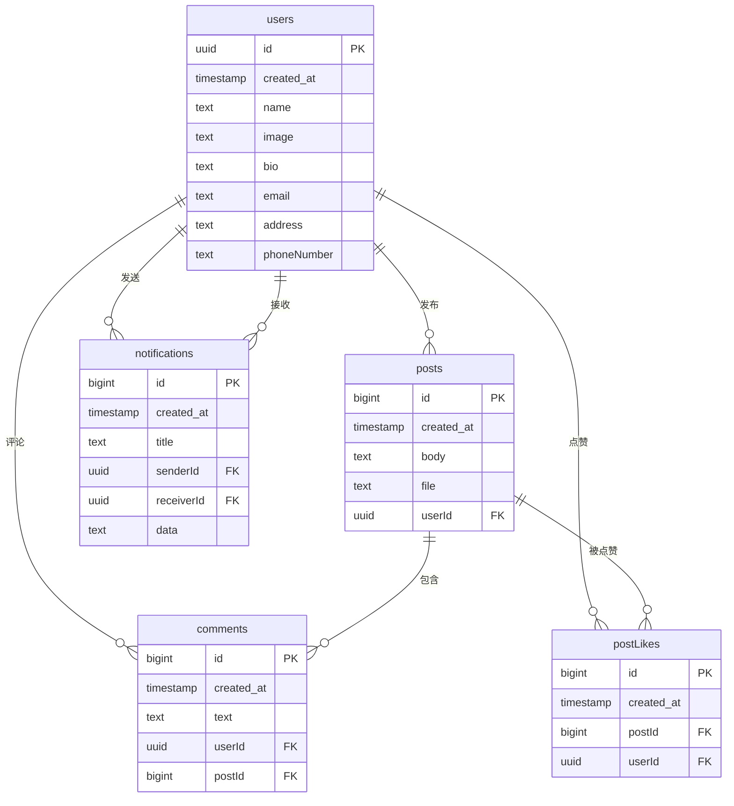

# 社交媒体应用数据库ER图

## 表关系说明

1. **users表** - 存储用户信息
   - 主键: id (UUID)
   - 包含用户基本信息如姓名、头像、简介、邮箱等

2. **posts表** - 存储用户发布的帖子
   - 主键: id (bigint)
   - 外键: userId 关联到users表
   - 一个用户可以发布多个帖子

3. **comments表** - 存储用户对帖子的评论
   - 主键: id (bigint)
   - 外键: userId 关联到users表
   - 外键: postId 关联到posts表
   - 一个用户可以发表多个评论
   - 一个帖子可以有多个评论

4. **postLikes表** - 记录用户对帖子的点赞
   - 主键: id (bigint)
   - 外键: userId 关联到users表
   - 外键: postId 关联到posts表
   - 一个用户可以点赞多个帖子
   - 一个帖子可以被多个用户点赞

5. **notifications表** - 存储系统通知
   - 主键: id (bigint)
   - 外键: senderId 关联到users表
   - 外键: receiverId 关联到users表
   - 一个用户可以发送多个通知
   - 一个用户可以接收多个通知 